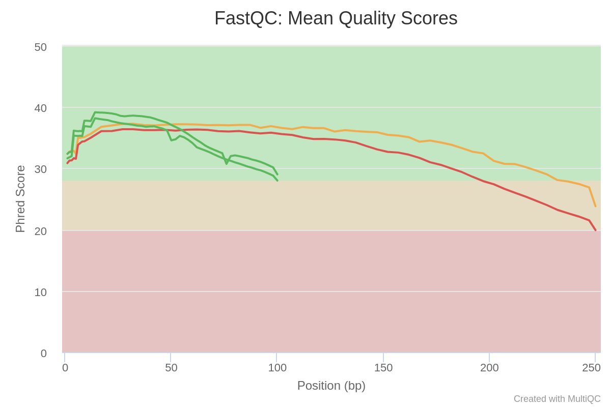
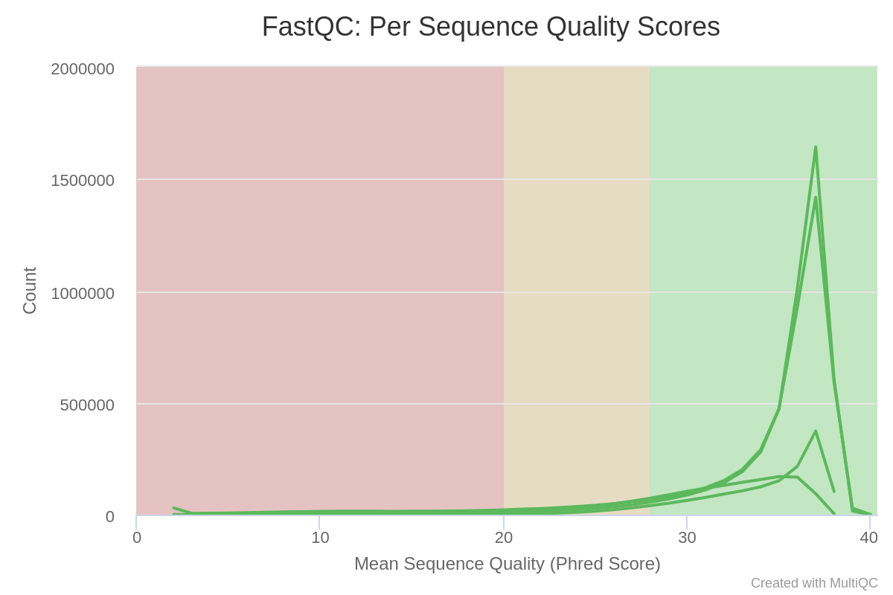
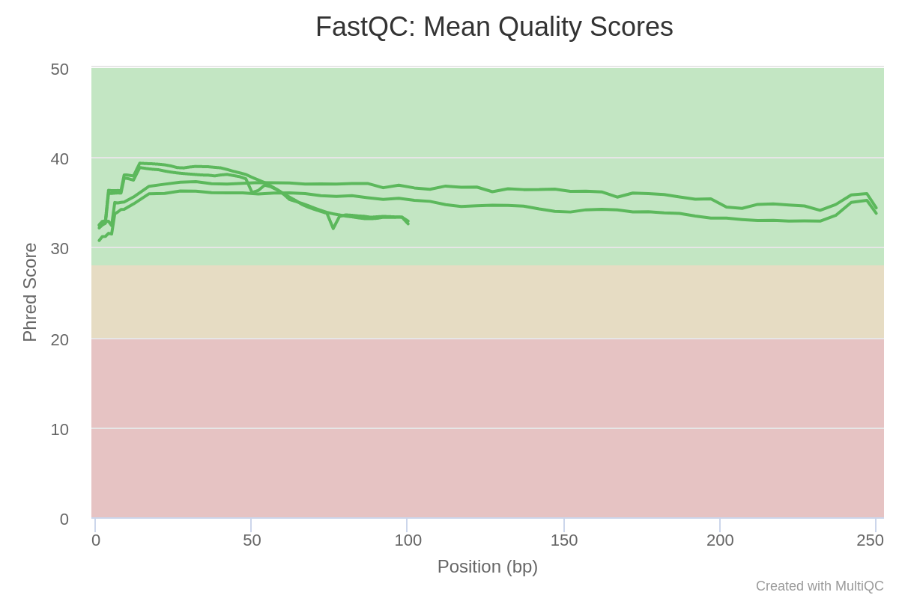
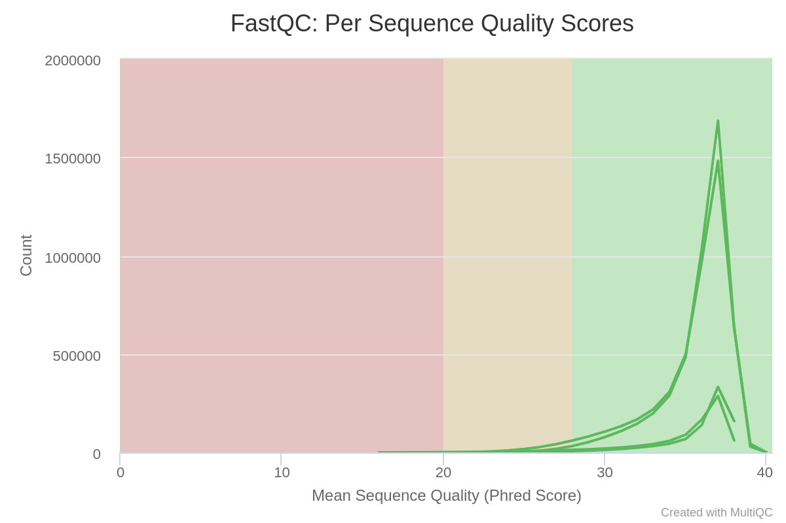

У нас есть папка `data`, в которой лежат симлинки на файлы из домашки.

Отберем сэмплы для последующего анализа.
```
seqtk sample -s 313 oil_R1.fastq 5000000 > oil_R1_sample.fastq
seqtk sample -s 313 oil_R2.fastq 5000000 > oil_R2_sample.fastq
seqtk sample -s 313 oilMP_S4_L001_R1_001.fastq 1500000 > oilMP_S4_L001_R1_001_sample.fastq
seqtk sample -s 313 oilMP_S4_L001_R2_001.fastq 1500000 > oilMP_S4_L001_R2_001_sample.fastq
```

Проведем анализ при помощи `fastqc` и затем `multiqc`.
```
mkdir stats
fastqc oil_R1_sample.fastq  oil_R2_sample.fastq oilMP_S4_L001_R1_001_sample.fastq oilMP_S4_L001_R2_001_sample.fastq -o stats
multiqc stats -o multistats
```
Скриншоты из статистики. Полный report тоже есть в репозитории и называется `multiqc_repot.html`



Подрежем чтения по качеству.
```
platanus_trim oil_R1_sample.fastq oil_R2_sample.fastq
platanus_internal_trim oilMP_S4_L001_R1_001_sample.fastq oilMP_S4_L001_R2_001_sa
mple.fastq
```
Удалим ненужные неподрезанные файлы.
```
rm oil_R1_sample.fastq oil_R2_sample.fastq
rm oil_R1_sample.fastq oil_R2_sample.fastq oilMP_S4_L001_R1_001_sample.fastq oilMP_S4_L001_R2_001_sample.fastq
```
```
mkdir stats_trimmed
fastqc oil_R1_sample.fastq.trimmed  oil_R2_sample.fastq.trimmed oilMP_S4_L001_R1_001_sample.fastq.int_trimmed oilMP_S4_L001_R2_001_sample.fastq.int_trimmed -o stats_trimmed
multiqc stats_trimmed -o multistats_trimmed
```
Скриншоты из статистики. Полный report тоже есть в репозитории и называется `trimmed_multiqc_repot.html`


Строим контиги.
```
platanus assemble -f oil_R1_sample.fastq.trimmed  oil_R2_sample.fastq.trimmed -o files
```
Строим скаффолды.
```
platanus scaffold -c files_contig.fa -IP1 oil_R1_sample.fastq.trimmed oil_R2_sample.fastq.trimmed -OP2 oilMP_S4_L001_R1_001_sample.fastq.int_trimmed oilMP_S4_L001_R2_001_sample.fastq.int_trimmed -o files
```
Сокращаем gaps.
```
platanus gap_close -c files_scaffold.fa -IP1 oil_R1_sample.fastq.trimmed oil_R2_sample.fastq.trimmed -OP2 oilMP_S4_L001_R1_001_sample.fastq.int_trimmed oilMP_S4_L001_R2_001_sample.fastq.int_trimmed -o files
```
Удаляем ненужное.
```
rm *trimmed
```

Теперь бонус (делаем все то же самое, но для меньших n, поэтому без подробностей).

Я взял выборку размером 10% от исходной.

```
yumdaniel@bioinflab-2:~/hw1_data$ seqtk sample -s 313 oil_R1.fastq 500000 > oil_R1_sample.fastq
yumdaniel@bioinflab-2:~/hw1_data$ seqtk sample -s 313 oil_R2.fastq 500000 > oil_R2_sample.fastq
yumdaniel@bioinflab-2:~/hw1_data$ seqtk sample -s 313 oilMP_S4_L001_R1_001.fastq 150000 > oilMP_S4_L001_R1_001_sample.fastq
yumdaniel@bioinflab-2:~/hw1_data$ seqtk sample -s 313 oilMP_S4_L001_R2_001.fastq 150000 > oilMP_S4_L001_R2_001_sample.fastq
```
```
platanus_trim oil_R1_sample.fastq oil_R2_sample.fastq
platanus_internal_trim oilMP_S4_L001_R1_001_sample.fastq oilMP_S4_L001_R2_001_sample.fastq
```
```
rm oil_R1_sample.fastq oil_R2_sample.fastq
rm oil_R1_sample.fastq oil_R2_sample.fastq oilMP_S4_L001_R1_001_sample.fastq oilMP_S4_L001_R2_001_sample.fastq
```
```
platanus assemble -f oil_R1_sample.fastq.trimmed  oil_R2_sample.fastq.trimmed -o files
```
```
platanus scaffold -c files_contig.fa -IP1 oil_R1_sample.fastq.trimmed oil_R2_sample.fastq.trimmed -OP2 oilMP_S4_L001_R1_001_sample.fastq.int_trimmed oilMP_S4_L001_R2_001_sample.fastq.int_trimmed -o files
```
```
platanus gap_close -c files_scaffold.fa -IP1 oil_R1_sample.fastq.trimmed oil_R2_sample.fastq.trimmed -OP2 oilMP_S4_L001_R1_001_sample.fastq.int_trimmed oilMP_S4_L001_R2_001_sample.fastq.int_trimmed -o files
```
```
rm *trimmed
```